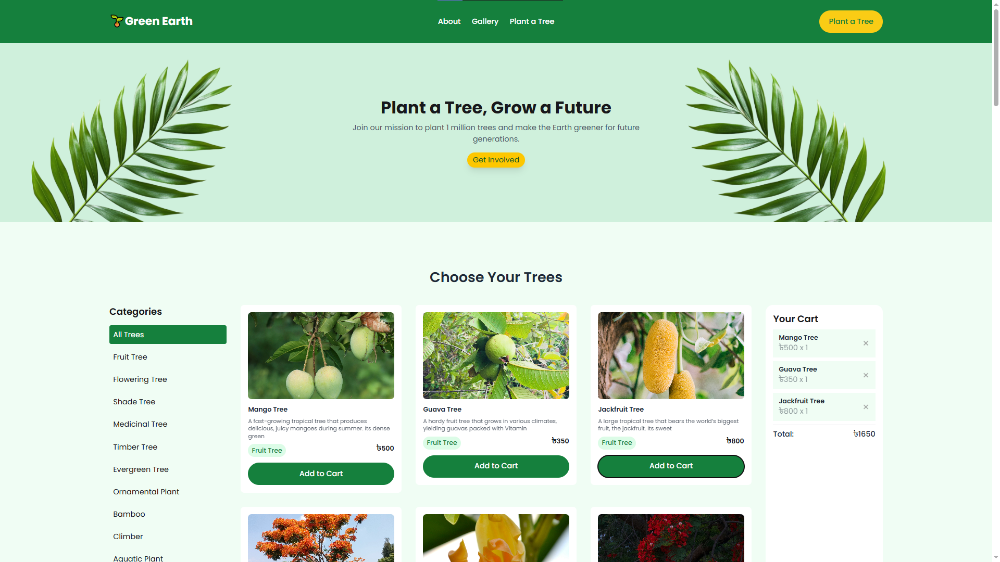
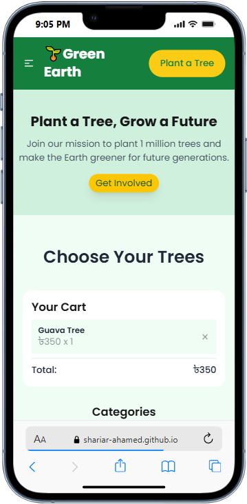

# 🌱 Green Earth

**Green Earth** is an interactive tree plantation website that allows users to explore various tree species, learn about their benefits, and contribute by planting trees. Featuring dynamic categories, detailed tree info, and a seamless Add to Cart system, it promotes environmental awareness and community involvement.


---

### 5. Answer the following questions clearly:

1. What is the difference between var, let, and const?  

**Answer:**  
- `var` → Function-scoped, can be re-declared & updated, hoisted with **undefined**.
- `let` → Block-scoped, can be updated but not re-declared in the same scope, hoisted but not initialized.
- `const` → Block-scoped, must be initialized, cannot be re-assigned (but objects/arrays can still be mutated).


2. What is the difference between map(), forEach(), and filter()?  

**Answer:**  
- map()     → Returns a new array with transformed elements  
- forEach() → Loops through array, performs action, returns nothing  
- filter()  → Returns a new array with elements that match a condition  


3. What are arrow functions in ES6? 

**Answer:**  
- Arrow functions (ES6) → A shorter syntax for writing functions.  
- Syntax: (params) => expression  
- Features:  
   • Concise and cleaner code  
   • No own `this` (inherits from surrounding scope)  
   • Cannot be used as constructors  


4. How does destructuring assignment work in ES6?

**Answer:**  
- Destructuring assignment (ES6) → Extracts values from arrays or objects into variables.  
- Makes code cleaner and shorter.  

Examples:  
// Array
const [a, b] = [1, 2]; // a = 1, b = 2

// Object
const {name, age} = {name: "Ripon", age: 24}; // name = "Ripon", age = 24


5. Explain template literals in ES6. How are they different from string concatenation? 

**Answer:**  
- Template literals (ES6) → Strings wrapped in backticks `` ` `` that allow embedded expressions and multi-line text.  
- Syntax: `${expression}` inside backticks.  
- Features:  
   • Easier variable interpolation  
   • Supports multi-line strings  
   • Cleaner and more readable than traditional concatenation  

Example:
const name = "Ripon";
const greeting = `Hello, ${name}!`; // "Hello, Ripon!"

---

## 🚀 Live Preview
[🌐 Open Project in Browser](https://shariar-ahamed.github.io/Green-Earth/)

---


## 📑 Table of Contents
1. [🌱 Green Earth](#-green-earth)  
2. [🚀 Live Preview](#-live-preview)  
3. [5. Answer the Questions](#5-answer-the-following-questions-clearly)  
   - [Var, Let, Const](#1-what-is-the-difference-between-var-let-and-const)  
   - [map(), forEach(), filter()](#2-what-is-the-difference-between-map-foreach-and-filter)  
   - [Arrow Functions](#3-what-are-arrow-functions-in-es6)  
   - [Destructuring Assignment](#4-how-does-destructuring-assignment-work-in-es6)  
   - [Template Literals](#5-explain-template-literals-in-es6-how-are-they-different-from-string-concatenation)  
4. [🌟 Features](#-features)  
5. [🖥️ Desktop View](#desktop-view)  
6. [📱 Mobile View](#mobile-view)  
7. [Usage](#usage)  
8. [Technologies Used](#technologies-used)  
9. [Folder Structure](#folder-structure)  
10. [License](#license)  
11. [Author](#author)  


---

## 🌟 Features
- Fully **responsive website design** for mobile, tablet, and desktop  
- **Dynamic category loading** for all tree categories  
- **3-column card layout** to display tree data  
- **Interactive modal** showing full tree details  
- **Add to Cart** functionality with live **total calculation**  
- **Remove from Cart** feature for updating totals dynamically  
- **Active category highlighting** on click  
- **Loading spinner** during data fetch (via API)  
- **Form submission** in “Plant a Tree Today” section  
- Beautiful **Banner with images, title, subtitle, and CTA button**  
- **About Campaign** section with image + text + bullet points  
- **Our Impact** section showing statistics in cards  
- **Vanilla JS, Tailwind CSS, DaisyUI** integration for modern UI  

---


## Desktop View:


## Mobile View:
<!-- Mobile Screenshot -->
<p align="center">
  
</p>


---

## Usage
1. **Clone the repository:**
	 ```sh
	 git clone https://github.com/Shariar-Ahamed/Green-Earth.git
	 ```
2. **Open `index.html` in your browser.**

---

## Technologies Used
- HTML5, CSS3 (with PostCSS)
- JavaScript (Vanilla)

---

## Folder Structure
```
├── assets
├── Project
├── index.html
|   ├── Green-Earth.fig
|   ├── README.md
├── style.css
├── scripts.js
├── images/
├── Screenshot/
│   ├── pc_screenshot.png
│   └── phone_screenshot.png
├── tailwind.config.js
└── ...
```

---

## License
This project is open-source and free to use for educational and non-commercial purposes.

---

## Author
**Shariar Ahamed**

For any suggestions or issues, please open an issue on the repository.